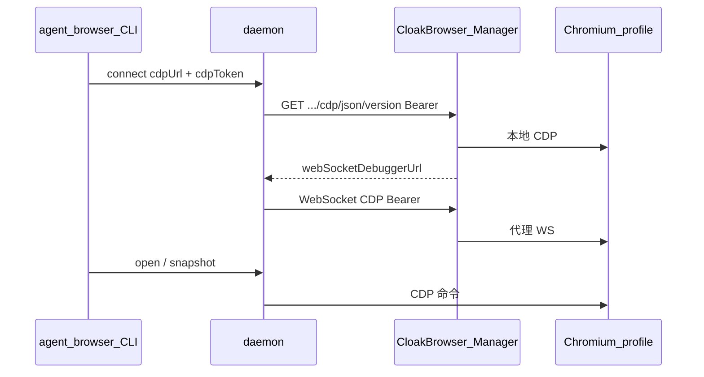

# agent-browser 本地增强 — 快速上手

本文档说明本仓库相对上游 [vercel-labs/agent-browser](https://github.com/vercel-labs/agent-browser) 的 **CloakBrowser-Manager CDP 增强**：改了什么、如何手工构建、如何连接 Manager 已登录的浏览器做自动化。

适用场景：**在 Manager 里用 noVNC 人工登录网站**，再用 `agent-browser` 通过 Manager 的 CDP 代理控制同一浏览器（cookie / 指纹与 Manager Launch 一致）。

---

## 我们做了什么增强

### 上游的限制

连接 `http://<host>:8080/api/profiles/<uuid>/cdp` 时，原版逻辑大致是：

1. 只取 URL 的 **host + port**，丢弃 `/api/profiles/.../cdp` 路径；
2. 固定请求 `http://host:port/json/version`（对 Manager 是错误的）；
3. **`--headers` 只作用于 `open` 页面导航**，不会带到 CDP 的 HTTP 发现与 WebSocket 握手；
4. 设了 `AUTH_TOKEN` 时，Manager 的 CDP / WebSocket 需要 **Bearer**，原版无法传 token → 401。

### 本仓库的改动

| 能力 | 说明 | 主要文件 |
|------|------|----------|
| **带 path 的 HTTP CDP 发现** | 对非根路径的 `http(s)://.../cdp`，请求 `{base}/json/version`、`{base}/json/list` | `cli/src/native/cdp/discovery.rs` |
| **发现 + WS 鉴权** | HTTP 发现与 WebSocket 连接均可带 `Authorization: Bearer <token>` | `discovery.rs`、`cli/src/native/cdp/client.rs` |
| **`--cdp-token` / `--cdp-headers`** | 专用于 CDP，与页面导航用的 `--headers` 分离 | `cli/src/flags.rs` |
| **环境变量** | `AGENT_BROWSER_CDP`、`AGENT_BROWSER_CDP_TOKEN`、`AGENT_BROWSER_CDP_HEADERS` | `cli/src/flags.rs`、`cli/src/connection.rs` |
| **launch 传参** | daemon 收到 `cdpToken` / `cdpHeaders` 后走 `connect_cdp_with_auth` | `cli/src/main.rs`、`cli/src/native/actions.rs` |
| **配置项** | `~/.agent-browser/config.json` / `./agent-browser.json` 支持 `cdp`、`cdpToken`、`cdpHeaders`（camelCase） | `cli/src/flags.rs` |

**未改动**：不 fork CloakBrowser；不要求 symlink / 单独 cloakserve。只要 Manager 里 profile **Launch running** 即可。

---

## 前置条件（CloakBrowser-Manager）

1. Manager 容器运行，例如：
   ```bash
   docker run -p 8080:8080 -v /opt/cloak-data:/data \
     -e AUTH_TOKEN=your-secret cloakhq/cloakbrowser-manager
   ```
2. 在 Web UI 中 **创建 profile → Launch → noVNC 登录** 目标站点（如 Hugging Face）。
3. 记下 **profile UUID**（Launch 后工具栏可复制 CDP URL，或 `GET /api/profiles` / `profiles.db`）。
4. 自动化前 profile 须保持 **Running**；Stop 后 CDP 返回 404。

### 连通性自检（可选）

```bash
export MANAGER_HOST="<manager-host>:8080"
export PROFILE_UUID="<profile-uuid>"
export AUTH_TOKEN="<your-auth-token>"

curl -sf -H "Authorization: Bearer ${AUTH_TOKEN}" \
  "http://${MANAGER_HOST}/api/profiles/${PROFILE_UUID}/cdp/json/version" \
  | jq -r .webSocketDebuggerUrl
```

应返回形如 `ws://<manager-host>:8080/api/profiles/<profile-uuid>/cdp` 的地址。

---

## 手工构建

仅需 **Rust**（无需 Node/pnpm，除非你还要改前端 skill 包）。

### 环境

- [rustup](https://rustup.rs/)，stable toolchain
- macOS / Linux（与上游一致；Windows 未在本流程验证）

### 编译

```bash
cd agent-browser/cli

# 调试版（开发）
cargo build

# 发布版（推荐日常使用）
cargo build --release

# 运行测试
cargo test
```

二进制路径：

| 配置 | 路径 |
|------|------|
| debug | `cli/target/debug/agent-browser` |
| release | `cli/target/release/agent-browser` |

### 安装到 PATH（任选其一）

```bash
cd agent-browser/cli
cargo install --path .          # 安装到 ~/.cargo/bin
# 或
cp target/release/agent-browser ~/.local/bin/
```

确认版本：

```bash
agent-browser --version
```

> **说明**：`npm install -g agent-browser` 安装的是上游预编译包，**不包含**本仓库的 Manager CDP 增强。要用增强功能，请用上述 `cargo build` / `cargo install --path .`。

---

## 如何使用

日常推荐把 CDP 地址与 token 写在 **[配置文件](#4-配置文件推荐)**（`~/.agent-browser/config.json`），之后直接 `agent-browser open` / `snapshot`，无需每次 `connect` 或 `--cdp-token`。

### 1. 连接 Manager CDP（命令行显式连接）

```bash
export MANAGER_HOST="<manager-host>:8080"
export PROFILE_UUID="<profile-uuid>"
export CDP_HTTP="http://${MANAGER_HOST}/api/profiles/${PROFILE_UUID}/cdp"
export AUTH_TOKEN="<your-auth-token>"

# 若已有旧 daemon 且选项未生效，先关闭
agent-browser close

agent-browser connect "${CDP_HTTP}" --cdp-token "${AUTH_TOKEN}"
```

成功时通常输出 `✓ Done`。之后同一 session 下可直接：

```bash
agent-browser open https://huggingface.co
agent-browser snapshot
agent-browser get url
```

### 2. 使用 `--cdp` 启动时连接

```bash
agent-browser --cdp "${CDP_HTTP}" --cdp-token "${AUTH_TOKEN}" open https://example.com
agent-browser --cdp "${CDP_HTTP}" --cdp-token "${AUTH_TOKEN}" snapshot
```

### 3. 环境变量（长期会话）

```bash
export MANAGER_HOST="<manager-host>:8080"
export PROFILE_UUID="<profile-uuid>"
export AGENT_BROWSER_CDP="http://${MANAGER_HOST}/api/profiles/${PROFILE_UUID}/cdp"
export AGENT_BROWSER_CDP_TOKEN="<your-auth-token>"

agent-browser close
agent-browser open https://huggingface.co   # 首次命令会拉起 daemon 并自动连 CDP
```

### 4. 配置文件（推荐）

CLI **已支持**通过 JSON 配置文件默认连接 Manager CDP。配置好后，日常命令（`open`、`snapshot` 等）会自动使用其中的 `cdp` / `cdpToken`，无需每次传参。

#### 配置文件位置与优先级

| 优先级（低 → 高） | 路径 | 说明 |
|-------------------|------|------|
| 1 | `~/.agent-browser/config.json` | **用户级默认**（推荐把 Cloak CDP 写在这里） |
| 2 | `./agent-browser.json` | 当前工作目录下的项目级覆盖 |
| 3 | 环境变量 `AGENT_BROWSER_*` | 覆盖文件中的值 |
| 4 | CLI 参数 `--cdp`、`--cdp-token` 等 | 最高优先级 |

使用 `--config <path>` 或环境变量 `AGENT_BROWSER_CONFIG` 时，**只加载指定文件**，不与上述两层自动合并。

#### 创建用户级配置

```bash
mkdir -p ~/.agent-browser
cat > ~/.agent-browser/config.json <<'EOF'
{
  "cdp": "http://<manager-host>:8080/api/profiles/<profile-uuid>/cdp",
  "cdpToken": "<your-auth-token>"
}
EOF
chmod 600 ~/.agent-browser/config.json
```

- JSON 字段使用 **camelCase**（与 `agent-browser --help` 中 Configuration 说明一致）。
- `cdpToken` 以明文保存在本地；请 `chmod 600`，且勿提交到 git。若不想落盘 token，可只在配置里写 `cdp`，用环境变量 `AGENT_BROWSER_CDP_TOKEN` 提供 token（环境变量优先级高于文件）。

额外 HTTP 头（可选）：

```json
{
  "cdp": "http://<manager-host>:8080/api/profiles/<profile-uuid>/cdp",
  "cdpToken": "<your-auth-token>",
  "cdpHeaders": "{\"X-Custom\":\"1\"}"
}
```

#### 配置后的日常用法

```bash
# 首次使用或修改配置 / token 后，先关掉旧 daemon
agent-browser close

# 之后无需 connect、无需 --cdp-token
agent-browser open https://huggingface.co
agent-browser snapshot
```

说明：

- 首次带 `cdp` 的命令会拉起 daemon，并通过 Manager CDP 连接（Bearer 由 `cdpToken` 提供）。
- `connect <url>` **仍需要**传入 URL；若已在配置里写了 `cdp`，日常请用 `open` / `snapshot`，不要与 `connect` 混用，以免边缘情况下重复 launch。
- 修改配置文件后，若 daemon 已在运行，需 `agent-browser close` 再执行下一条命令，新配置才会生效。

### 5. CLI 参数一览（CDP 相关）

| 参数 | 环境变量 | 作用 |
|------|----------|------|
| `--cdp <port\|url>` | `AGENT_BROWSER_CDP` | CDP 端口或完整 URL（含 Manager HTTP 根地址） |
| `--cdp-token <secret>` | `AGENT_BROWSER_CDP_TOKEN` | 转为 `Authorization: Bearer <secret>` |
| `--cdp-headers '<json>'` | `AGENT_BROWSER_CDP_HEADERS` | 额外 CDP HTTP/WS 头（JSON 对象） |
| `connect <url>` | — | 等价于 `launch` + `cdpUrl`；可配合 `--cdp-token` |

`--headers` **仅用于** `open` 等导航，**不**替代 `--cdp-token`。

### 6. 与上游相同的其它 CDP 形式

本增强**同时保留**上游行为：

- `agent-browser connect 9222` — 本机 Chrome 调试端口；
- `agent-browser connect "ws://..."` — 已知 WebSocket URL 直连（若已有 token，仍需 `--cdp-token` 以便 WS 握手）；
- `agent-browser --auto-connect` — 发现本机已运行的 Chrome。

---

## 端到端示例（Hugging Face 登录态）

验证步骤（请替换为你的 Manager 地址、profile UUID 与 token）：

- CDP：`http://<manager-host>:8080/api/profiles/<profile-uuid>/cdp`
- Token：与 Manager 的 `AUTH_TOKEN` 一致
- Manager 中该 profile 已 Launch，noVNC 已登录目标站点

```bash
AB=./cli/target/debug/agent-browser   # 或 release / cargo install 后的 agent-browser
export MANAGER_HOST="<manager-host>:8080"
export PROFILE_UUID="<profile-uuid>"
export AUTH_TOKEN="<your-auth-token>"
CDP_HTTP="http://${MANAGER_HOST}/api/profiles/${PROFILE_UUID}/cdp"

$AB close
$AB connect "${CDP_HTTP}" --cdp-token "${AUTH_TOKEN}"

$AB open https://huggingface.co
$AB snapshot | grep -i '<your-username>'   # 应能看到已登录用户名相关文本
```

---

## 故障排查

| 现象 | 可能原因 | 处理 |
|------|----------|------|
| `/json/version` 401 | token 错误或未传 `--cdp-token` | 检查 `AUTH_TOKEN` 与 Bearer |
| 404 Profile not running | Manager 未 Launch | UI 中 Launch profile |
| 连到 `host:8080/json/version`（无 path） | 用了未编译的本仓库二进制 | `cargo build` 后用 `target/.../agent-browser` |
| `connect` 成功但页面未登录 | 连错 profile 或 HF 会话过期 | 在 noVNC 确认登录；换 UUID |
| 改了 `--cdp-token` 或配置文件仍无效 | 旧 daemon 仍在 | `agent-browser close` 后重连 |
| 配置了 `cdp` 但未连上 Manager | 路径写错或未 `close` | 核对 `~/.agent-browser/config.json`；改配置后先 `close` |
| WS 401、HTTP 200 | 仅发现带了 token，需确认已用本仓库构建 | 见上 |

---

## 架构简图



---

## 相关文档

- 上游完整命令说明：[README.md](./README.md)（CDP Mode 等章节）
- CloakBrowser / Manager 运维笔记（本 monorepo）：`../aiAgent/skillAndPlugin/browser/cloak-browser.md`
- Manager CDP 路由实现：`../CloakBrowser-Manager/backend/main.py`（`/api/profiles/{id}/cdp/json/version`）

---

## CI 构建与发版（GitHub Actions）

### 仅构建（上传 CI 附件）

手工触发 workflow：[`.github/workflows/cloak-build.yml`](.github/workflows/cloak-build.yml)（**Cloak Build**）。

- **触发**：GitHub → **Actions** → **Cloak Build** → **Run workflow**
- **输入 `ref`**：要构建的 Git 引用，可为分支名、commit SHA、tag 等；**默认 `cloak`**
- **行为**：检出对应代码 → 交叉编译三个平台二进制 → 上传到 **Actions 运行页的 Artifacts**（不创建 GitHub Release、不 push 分支）
- **产物**（每个平台单独一个 artifact，另有一个合并包）：
  - `agent-browser-linux-amd64`
  - `agent-browser-linux-arm64`
  - `agent-browser-darwin-arm64`
  - `agent-browser-bundle-<run_id>`（含上述三个文件 + `SHA256SUMS`）
- **权限**：只需 **Read** 仓库内容（无需 write）

适用于：验证某个 commit/分支能否编过、在发版前试构建、从非 `cloak` 引用临时打包。

---

### 完整发版（Cloak Release）

仓库提供手工触发的 workflow：[`.github/workflows/cloak-release.yml`](.github/workflows/cloak-release.yml)（**Cloak Release**）。

### 触发方式

GitHub → **Actions** → **Cloak Release** → **Run workflow**，填写 **release_tag**（本仓库 Release 用的版本名，如 `v0.27.0-cloak.1`；**不要求**与上游 tag 一致）。

### 流程说明

1. 从 [vercel-labs/agent-browser](https://github.com/vercel-labs/agent-browser) 拉取 **最新 `main`**，**强制同步**到 fork 的 `main`（与输入的 release_tag 无关）。
2. 将增强分支 **`cloak`** 基于**本地 `main`** 做 `rebase` 并推送；若有冲突则 **CI 失败**（需在本地解决后重跑）。
3. 在 **`cloak`** 分支上交叉编译 Rust CLI，Release 附件名为 **`agent-browser`**（按平台加后缀）：
   - `agent-browser-linux-amd64`
   - `agent-browser-linux-arm64`
   - `agent-browser-darwin-arm64`
4. 在 [weizhoublue/agent-browser](https://github.com/weizhoublue/agent-browser) 创建 **GitHub Release**（tag = 输入的 **release_tag**），附带上述二进制与 `SHA256SUMS`。
5. **仅在 Release 创建成功后**，推送归档分支 **`release/<release_tag>`**（保存该次 rebase 后的完整源码快照；构建或发版失败则不会创建归档分支）。

### 安装 Release 二进制

```bash
# 示例：Linux x86_64
curl -LO https://github.com/weizhoublue/agent-browser/releases/download/v0.27.0/agent-browser-linux-amd64
chmod +x agent-browser-linux-amd64
sudo mv agent-browser-linux-amd64 /usr/local/bin/agent-browser

agent-browser -h   # 应看到 "Supports CloakBrowser" 一行（上游版无此行）
agent-browser connect "http://..." --cdp-token "..."
```

> Release 文件名带平台后缀；安装到 PATH 后命令仍为 **`agent-browser`**。与上游预编译包区分：运行 `agent-browser -h`，增强版会显示 **Supports CloakBrowser**。

### 权限要求

- 仓库 **Settings → Actions → General**：Workflow 需有 **Read and write** 权限（用于 push `main` / `cloak` / `release/*` 与创建 Release）。
- 若 `main` 有分支保护，需允许 `github-actions[bot]` 推送或临时放宽保护。

---

## 维护说明

- 增强代码均在 **`cli/`** Rust 工程内；发版前请在 `cli/` 执行 `cargo test`。
- 合并上游 agent-browser 时重点冲突文件：`discovery.rs`、`browser.rs`、`flags.rs`、`actions.rs`、`main.rs`、`connection.rs`、`cdp_auth.rs`。
- 日常开发在 **`cloak`** 分支；发版 workflow 会自动 rebase 并打 `release/<tag>` 归档。
- 文档中的 `<manager-host>`、`<profile-uuid>`、`<your-auth-token>` 为占位符，请替换为你环境中的实际值。
- 默认 CDP 连接推荐 `~/.agent-browser/config.json`；详见上文 [配置文件](#4-配置文件推荐) 一节。
